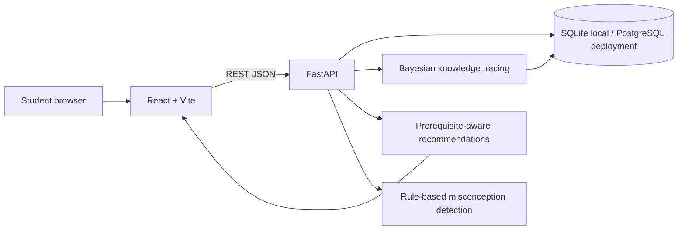
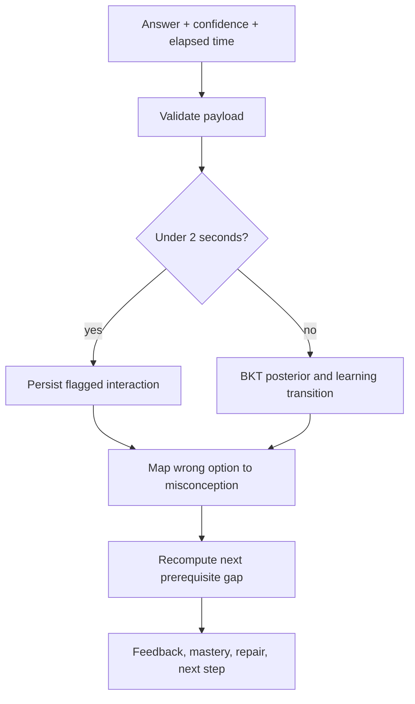

# Architecture

```mermaid
flowchart LR
  Student[Student browser] --> UI[React + Vite]
  UI -->|REST JSON| API[FastAPI]
  API --> DB[(SQLite local / PostgreSQL deployment)]
  API --> BKT[Bayesian knowledge tracing]
  API --> Optimizer[Prerequisite-aware recommendations]
  API --> Misconceptions[Rule-based misconception detection]
  BKT --> DB
  Optimizer --> UI
```

The initial implementation uses a deterministic fallback and SQLite. Production authentication, LLM analysis, WebSockets, PostgreSQL and Redis remain planned work.

```mermaid
flowchart TD
  Answer[Answer + confidence + elapsed time] --> Validate[Validate payload]
  Validate --> Anomaly{Under 2 seconds?}
  Anomaly -->|yes| PersistFlag[Persist flagged interaction]
  Anomaly -->|no| Update[BKT posterior and learning transition]
  PersistFlag --> Detect[Map wrong option to misconception]
  Update --> Detect
  Detect --> Replan[Recompute next prerequisite gap]
  Replan --> Response[Feedback, mastery, repair, next step]
```
