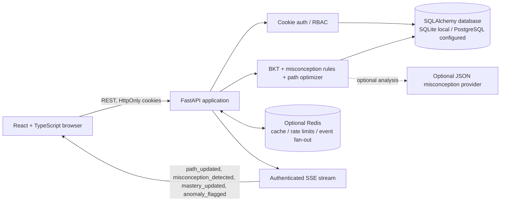

# Architecture and data flow

## Component architecture



## Answer-to-path data flow

```mermaid
sequenceDiagram
  actor Student
  participant UI as React client
  participant API as FastAPI
  participant Auth as Session / role guard
  participant DB as SQL database
  participant Engine as BKT + anomaly + path logic
  participant Events as SSE / optional Redis fan-out
  Student->>UI: choose answer and confidence
  UI->>API: POST /api/interactions (cookie, question, answer, confidence, timing)
  API->>Auth: validate signed-in student
  Auth-->>API: authenticated user ID
  API->>DB: load question and this user's prior state
  API->>Engine: score answer, confidence, timing and pattern
  Engine-->>API: weighted mastery and misconception result
  API->>DB: persist interaction, mastery, misconception and revised path
  API->>Events: publish state-change events
  API-->>UI: interaction result and path revision reason
  Events-->>UI: live event; UI refreshes affected data
```

The persisted entities and relationships are generated from SQLAlchemy metadata in [data-model.md](data-model.md). Public and authenticated routes are listed in [API.md](API.md), generated from [openapi.json](openapi.json).
