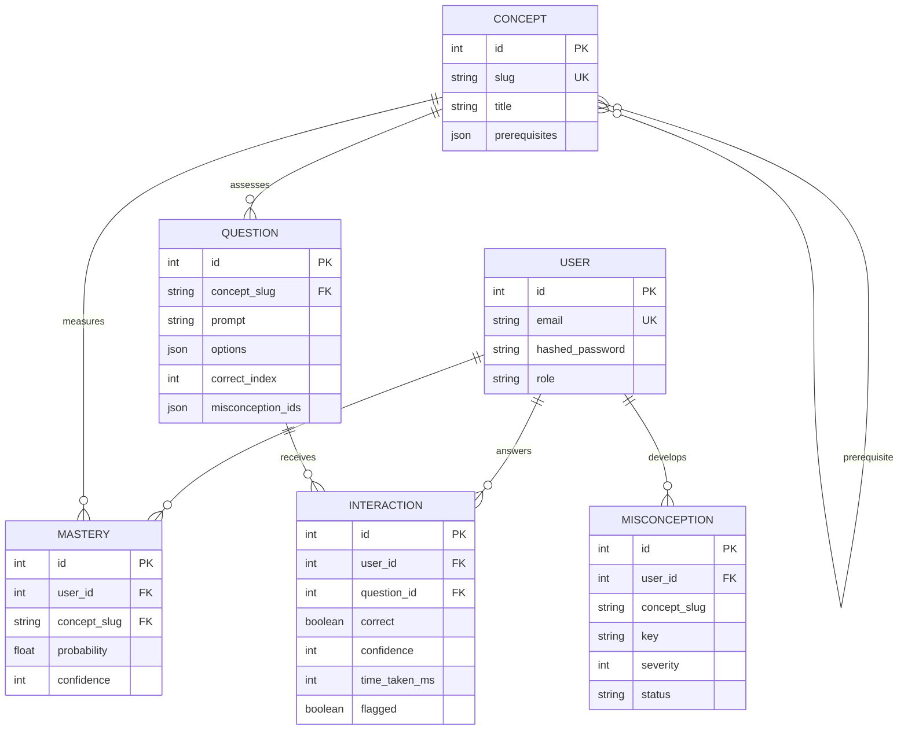

# Data model

```mermaid
erDiagram
  USER ||--o{ MASTERY : tracks
  USER ||--o{ INTERACTION : answers
  USER ||--o{ MISCONCEPTION : develops
  CONCEPT ||--o{ QUESTION : assesses
  CONCEPT ||--o{ MASTERY : measures
  QUESTION ||--o{ INTERACTION : receives
  CONCEPT }o--o{ CONCEPT : prerequisite
  USER {
    int id PK
    string email UK
    string hashed_password
    string role
  }
  CONCEPT {
    int id PK
    string slug UK
    string title
    json prerequisites
  }
  QUESTION {
    int id PK
    string concept_slug FK
    string prompt
    json options
    int correct_index
    json misconception_ids
  }
  MASTERY {
    int id PK
    int user_id FK
    string concept_slug FK
    float probability
    int confidence
  }
  INTERACTION {
    int id PK
    int user_id FK
    int question_id FK
    boolean correct
    int confidence
    int time_taken_ms
    boolean flagged
  }
  MISCONCEPTION {
    int id PK
    int user_id FK
    string concept_slug
    string key
    int severity
    string status
  }
```
